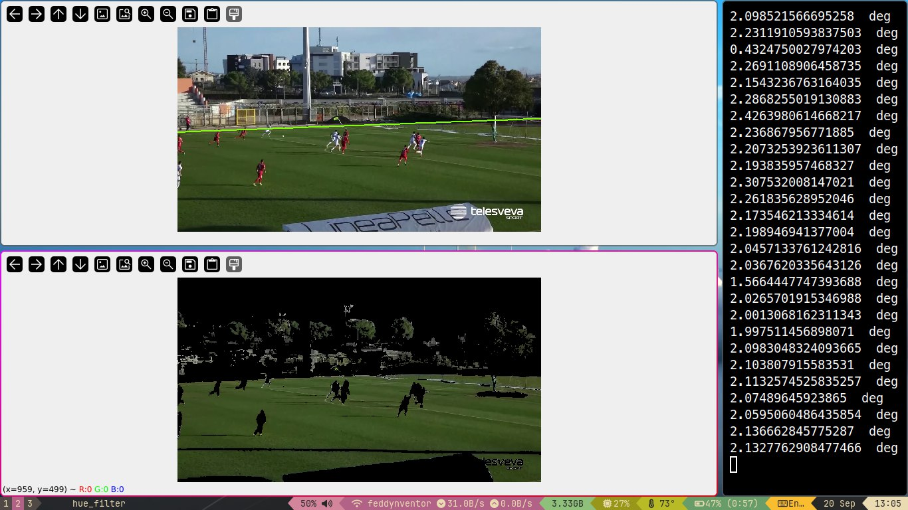

working on something that can help me identify characteristics of the image

This repository contains many files used to study computer vision.

The `main.py` script accepts a `VideoCapture` argument and so it traces the border of a football field via HSV filtering.
The line is interpolated with Ransac which is not the optimal solution.

## Pipeline
- color data from histogram
- filtering noise
- identifying characteristic
- interpolating noisy data and finalizing characteristic information

### Sobel
it is a discrete differentiation operator, computing an approximation of the gradient of the image intensity function

### Otsu
automatic image thresholding.[1] In the simplest form, the algorithm returns a single intensity threshold that separate pixels into two classes, foreground and background.

This threshold is determined by minimizing intra-class intensity variance, or equivalently, by maximizing inter-class variance.

### k-means
aims to partition n observations into k clusters in which each observation belongs to the cluster with the nearest mean (cluster centers or cluster centroid)

